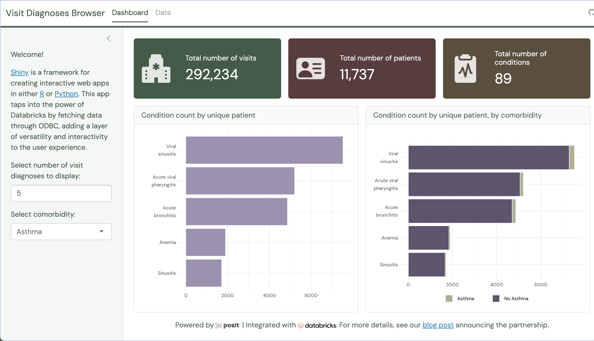

# Visit Diagnoses Browser

This dashboard presents a simulated Electronic Health Record (EHR) dataset generated by [Synthea](), representing the medical records of approximately 11,000 patients from Massachusetts.

The team at Databricks used PySpark, a framework for Apache Spark in Python, to ingest data from CSV files, clean patient Personally Identifiable Information (PII), and store the de-identified data in Delta Lake, a robust storage layer. With Delta tables, they created a database storing the patient records for subsequent data analysis.

More details regarding their methodology can be found in the blog post [Building a Modern Clinical Health Data Lake with Delta Lake](https://www.databricks.com/blog/2020/04/21/building-a-modern-clinical-health-data-lake-with-delta-lake.html) by Frank Austin Nothaft, Michael Ortega, and Amir Kermany.

We pulled the data into [RStudio](https://posit.co/download/rstudio-desktop/) using the [odbc package](https://odbc.r-dbi.org/) and used it to create a [Shiny app](https://shiny.posit.co/) with [bslib](https://rstudio.github.io/bslib/index.html). More on working with databases on RStudio is available on the [Posit Solutions](https://solutions.posit.co/connections/db/) site.
