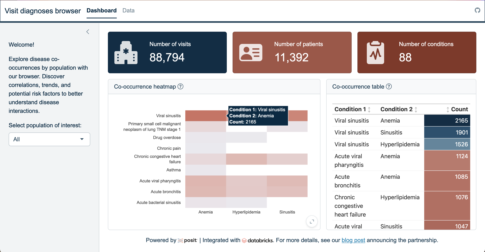

# Visit Diagnoses Browser



The Visit Diagnoses Browser presents a simulated Electronic Health Record (EHR) dataset generated by [Synthea](https://synthetichealth.github.io/synthea/), representing the medical records of approximately 11,000 patients from Massachusetts.

The team at Databricks used PySpark, a framework for Apache Spark in Python, to ingest data from CSV files, clean patient Personally Identifiable Information (PII), and store the de-identified data in Delta Lake, a robust storage layer. With Delta tables, they created a database storing the patient records for subsequent data analysis.

More details regarding their methodology can be found in the blog post [Building a Modern Clinical Health Data Lake with Delta Lake](https://www.databricks.com/blog/2020/04/21/building-a-modern-clinical-health-data-lake-with-delta-lake.html) by Frank Austin Nothaft, Michael Ortega, and Amir Kermany.

We pulled the data into [RStudio](https://posit.co/download/rstudio-desktop/) using the [odbc package](https://odbc.r-dbi.org/) and used it to create a [Shiny app](https://shiny.posit.co/) with [bslib](https://rstudio.github.io/bslib/index.html). More on working with databases on RStudio is available on the [Posit Solutions](https://solutions.posit.co/connections/db/) site.

We tap into the power of Databricks by fetching the EHR data contained in the Delta tables through ODBC. Creating the browser in Shiny adds a layer of versatility and interactivity to the user experience.

Thanks to the power of bslib, we can customize our Shiny app with layouts, tooltips, themes, and more.

## Installation/Setup

To rebuild this app, you must have:

* A Databricks SQL warehouse, where the EHR data is stored
* The Databricks ODBC driver installed on your laptop, or access to [Posit Professional Drivers](https://docs.posit.co/pro-drivers/)
* An R environment with associated packages

## Accessing the EHR data in Databricks

In this example, the EHR data is stored under `demos` > `ehr` > `encounters`. Create this table in Databricks by running the script below:

```
CREATE TABLE encounters USING com.databricks.spark.csv OPTIONS(path 'dbfs:/databricks-datasets/rwe/ehr/csv/encounters.csv', header "true");
```

## Accessing the SQL warehouse HTTP path

[Find the](https://solutions.posit.co/connections/db/databases/databricks/#databricks-http-path) HTTP Path needed for the SQL warehouse by:

1. Navigating to your Databricks web UI
1. Selecting SQL Warehouses from the left menu
1. In the interface to the right, selecting Connection details
1. Copying the value under HTTP path

## Download the ODBC driver

Download the ODBC driver [directly from Databricks](https://www.databricks.com/spark/odbc-drivers-download). For Posit Workbench, RStudio Desktop Pro, Posit Connect, or Shiny Server Pro users, you can download and use Posit Professional Drivers at no additional charge.

## Connecting to the Databricks SQL warehouse

In RStudio (or your IDE of choice), install and load the DBI and odbc package. 

```r
install.packages("DBI")
install.package("odbc")
```

If you are using odbc v1.4.0 or above, the `odbc::databricks()` function makes it easier to connect to Databricks. Run the code below to make the connection, inputting your HTTP Path obtained in the step above:

```r
con <- DBI::dbConnect(
  odbc::databricks(),
  httpPath = "[SQL Warehouse service path]"
  )
```


